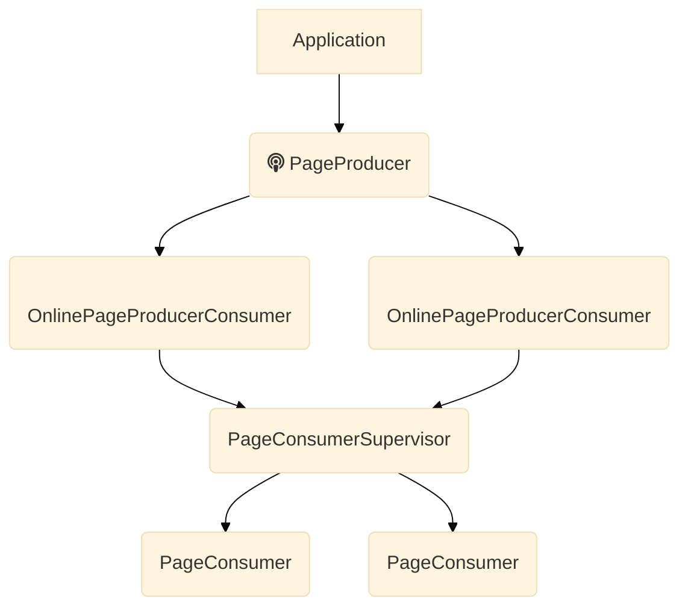

```mermaid
%%{init: {'theme':'base'}}%%
graph TD
    A[Application] --> B(fa:fa-podcast PageProducer)
    B --> C(fa:fa-snowflake-o OnlinePageProducerConsumer)
    B --> D(fa:fa-snowflake-o OnlinePageProducerConsumer)
    C --> E(PageConsumerSupervisor)
    D --> E(PageConsumerSupervisor)
    E --> G(PageConsumer)
    E --> H(PageConsumer)


```
